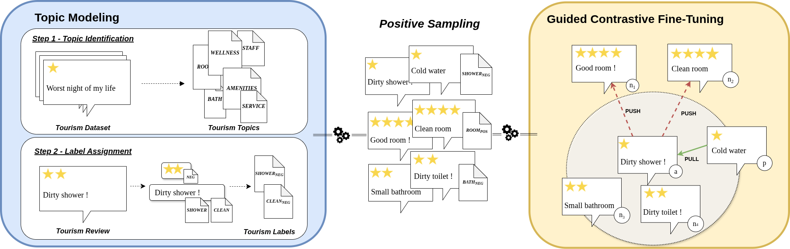

# Tourism Mining: Reorganizing Sentence Transformer Embeddings for Tourism Opinion Mining via Topic Modeling of Customer Reviews



## Installation & Setup

## Datasets
We use publicly available datasets to train:
- **Hotel**: [HotelRec](https://www.kaggle.com/datasets/hariwh0/hotelrec-dataset-1)
- **Restaurant**: [TripAdvisor NLP Dataset](https://www.kaggle.com/datasets/inigolopezrioboo/a-tripadvisor-dataset-for-nlp-tasks)


Ensure you download these datasets and place them in the `data/raw/` directory before running the scripts.

## Language Filtering
Download "lid.176.bin"  and place it the `data/fasttext/` :  https://fasttext.cc/docs/en/language-identification.html

## Requirements
Ensure you have the necessary dependencies installed before running the scripts:
```sh
pip install -r requirements.txt
```

## Training and Evaluation

### Generate Training Data
```sh
python task_positive_cat.py # Our contribution
python task_positive_simcse.py
python task_positive_senticse.py
```


### Training TourCSE
To train TourCSE embeddings, run:
```sh
python pipeline_train_embeddings.py
```

### Evaluating the Model
To evaluate the trained embeddings, execute:
```sh
python pipeline_eval_embeddings.py
```

### Embeddings vizualisation
```sh
python pipeline_generate_tsne_stars.py
```